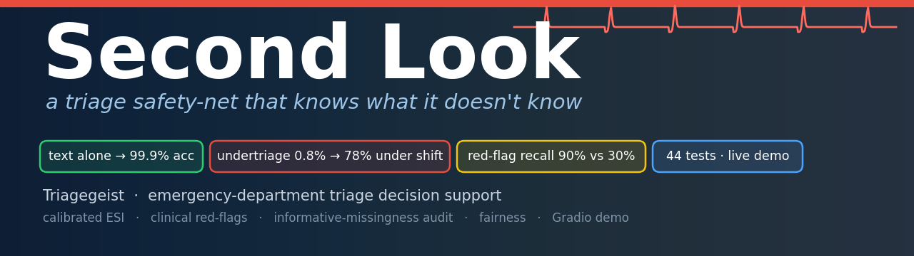
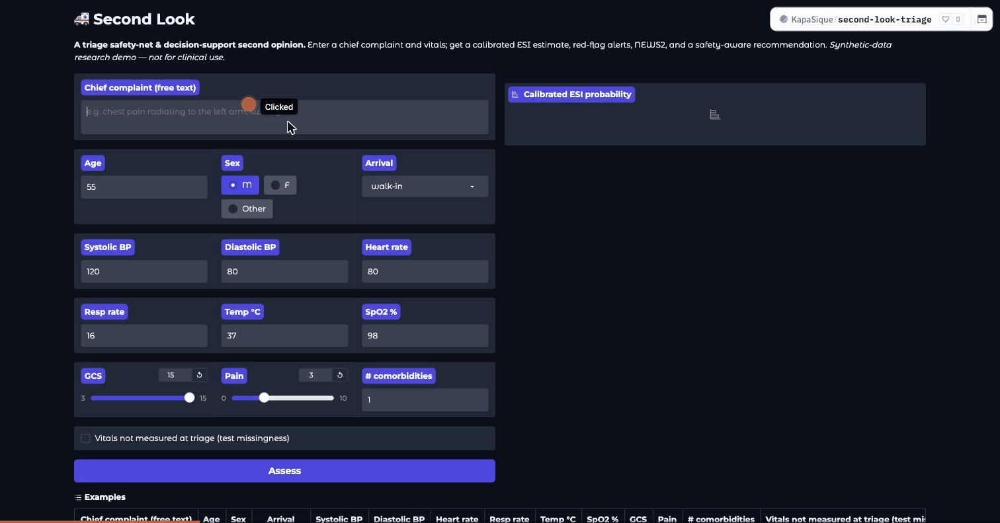
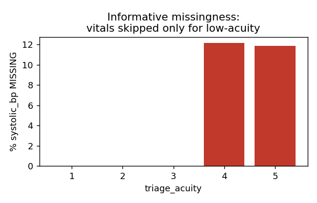
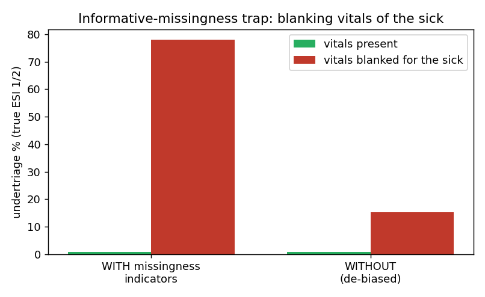
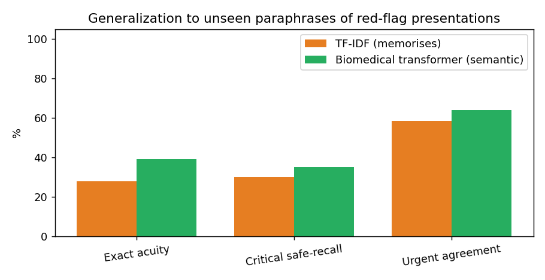
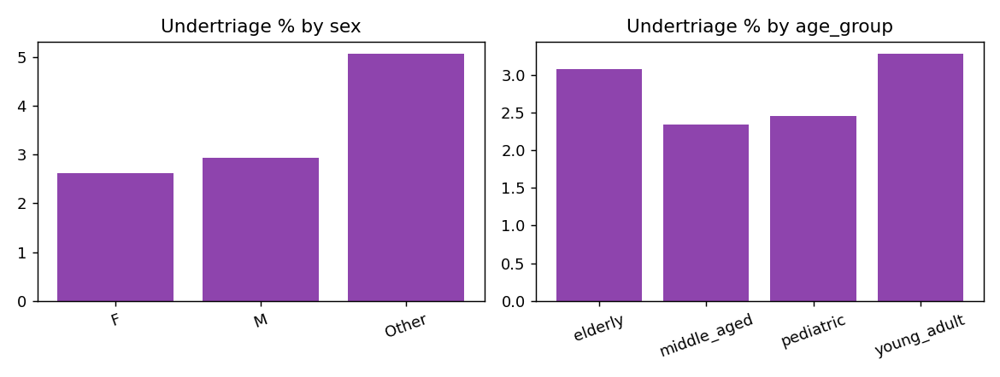

<p align="center">
  
</p>

<p align="center">
  <a href="https://huggingface.co/spaces/KapaSique/second-look-triage"></a>
  <a href="https://www.kaggle.com/code/ssstelmah/second-look-triage-safety-net"></a>
  <a href="https://www.kaggle.com/competitions/triagegeist"></a>
  <a href="LICENSE"></a>
</p>

<p align="center">
  
  
  
  
  
</p>

> ⚠️ **Research demonstration on _synthetic_ data. Not a medical device.** Second Look supports, never replaces, clinician judgement.

---

## The one idea

On the provided synthetic data, the free-text chief complaint predicts the ESI label with **~99.9 % accuracy** — so **accuracy is not a meaningful objective here.** The real, clinically important problem is **safe behaviour under realistic conditions**: catching the occult high-risk patient, not collapsing when data is missing, staying calibrated, and being honest about what synthetic data can and cannot prove. *Second Look* is built around that.

## ▶ See it catch a heart attack — [try it live](https://huggingface.co/spaces/KapaSique/second-look-triage)

<p align="center">
  
</p>

> **Input** · *“chest pain radiating to the left arm, sweaty and short of breath”* — with **normal vitals**
> **Model alone** → ESI **3** (56 %) · it would **under-triage** a likely heart attack
> **Second Look** → 🚩 `ACS (critical)` red-flag fires → **escalates to ESI 2 · ESCALATE**

The vitals-blind red-flag layer is the safety net: it can only ever *raise* urgency, never silently lower it.

## Findings — every number reproduced by the notebook & kernels

| # | Finding | Evidence |
|---|---|---|
| 1 | Accuracy is a mirage — the label is a near phrase→ESI lookup | text-only **acc 0.9994** (5-fold) · 4 949 complaints, 99.7 % single-acuity, 99.8 % of test seen in train |
| 2 | **Informative missingness is a deployment trap** | blanking the *sick* patients’ vitals drives fusion-model undertriage **0.8 % → 78 %**; de-biasing → 15 % |
| 3 | Occult high-risk patients exist; vitals miss them | NEWS2-only accuracy ceiling **65 %** · free text + red-flags catch them |
| 4 | **Clinical knowledge generalises; memorisation doesn’t** | critical safe-recall on paraphrases — TF-IDF 30 % · transformer 35 % · **red-flag ontology 90 %** |
| 5 | Calibrated & audited | held-out acc 0.992 · undertriage 2.8 % · ECE 0.106 · fairness reported across sex/age/language/insurance |

<p align="center">
  
  
  
  
</p>
<p align="center"><sub>informative missingness · missingness stress-test (the deployment trap) · paraphrase generalization · subgroup fairness</sub></p>

## The system — 7 unit-tested modules (`src/`)

| Module | Responsibility |
|---|---|
| `data_prep` | load/merge 4 tables; feature engineering with **explicit, honest** missingness indicators |
| `model_core` | calibrated fusion classifier (vitals + demographics + TF-IDF); CV / ECE / undertriage |
| `redflag` | vitals-independent clinical **can't-miss ontology** + matcher (clinical + lay synonyms) |
| `policy` | cost-sensitive decision policy; red-flag & NEWS2 floors can only **escalate** |
| `audit` | fairness · missingness stress-test · calibration reliability |
| `clinical` | NEWS2 calculator + derived vitals |
| `explain` + `app/` | per-patient rationale + the Gradio demo |

## Reproduce

```bash
pip install -r requirements.txt
pip install pytest && PYTHONPATH=. pytest -q          # 44 tests
```

Heavy compute runs as reproducible **Kaggle kernels** (`kaggle/`): `forensics`, `generalization`, `audit` — each imports the same tested `src` modules and regenerates every number and figure. The public [notebook](https://www.kaggle.com/code/ssstelmah/second-look-triage-safety-net) runs the whole pipeline end-to-end. Full rationale: [`docs/superpowers/specs/`](docs/superpowers/specs/2026-06-13-triagegeist-second-look-design.md).

> **Data** is *not* redistributed here (competition rules). Download it from the [competition data page](https://www.kaggle.com/competitions/triagegeist/data) into `data/`.

## Honesty & limitations

The data is synthetic: labels are near-deterministic in severity, with **no** rater/site variability and **no** injected demographic bias — so we make **no** claim to have found bias or drift *in the data*. Every conclusion is about our **model** and **deployment conditions**. The red-flag ontology was hand-built with the paraphrase probe in mind (its 90 % reflects design intent; TF-IDF / transformer are zero-shot). External validity is unproven and demands real corpora (**MIMIC-IV-ED, NHAMCS**) before any deployment.

## License

Code: [MIT](LICENSE). Synthetic competition data is **not** included (non-commercial research license, no redistribution).

<p align="center"><sub>Built for the <a href="https://www.kaggle.com/competitions/triagegeist">Triagegeist</a> hackathon · Laitinen-Fredriksson Foundation</sub></p>
